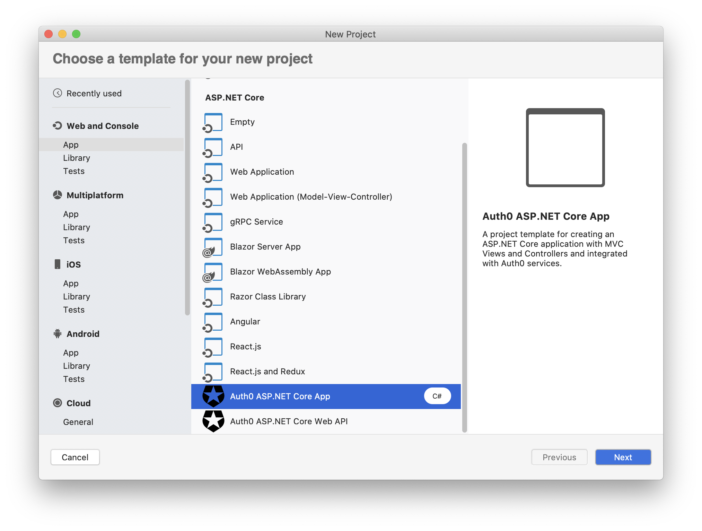
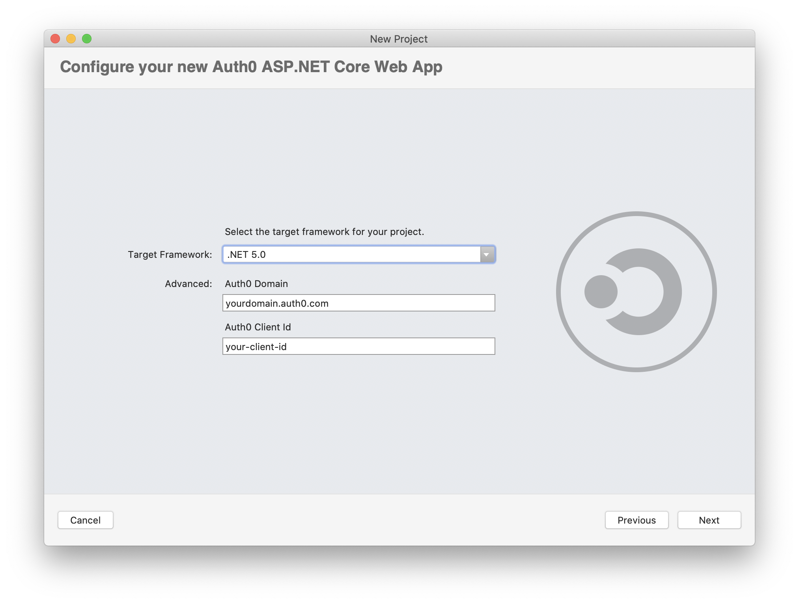
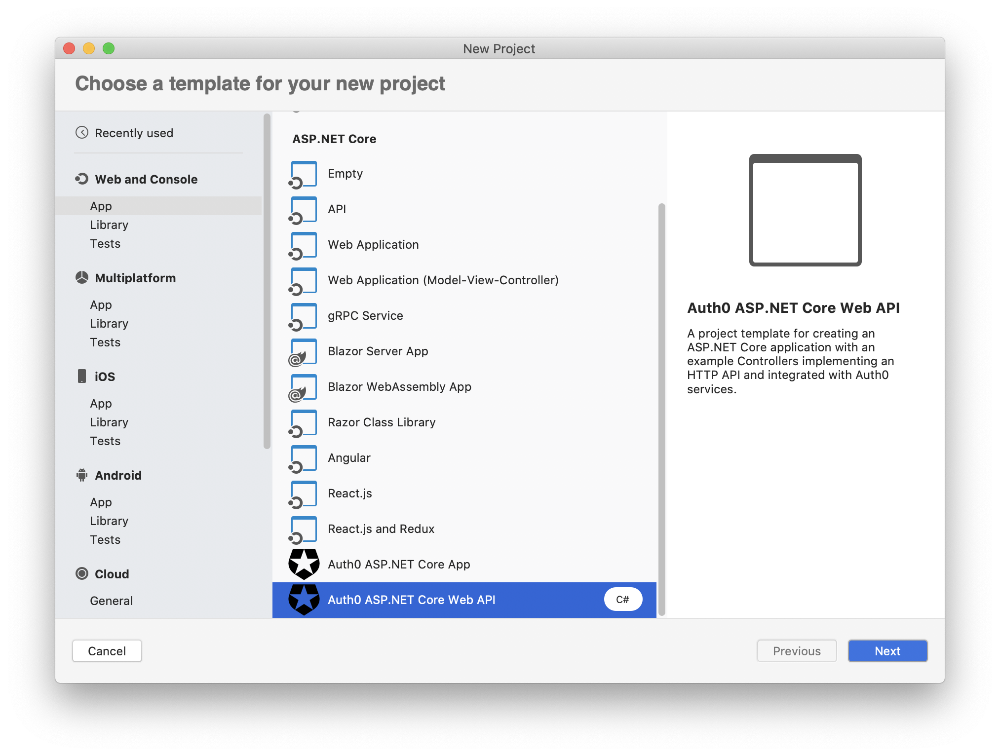
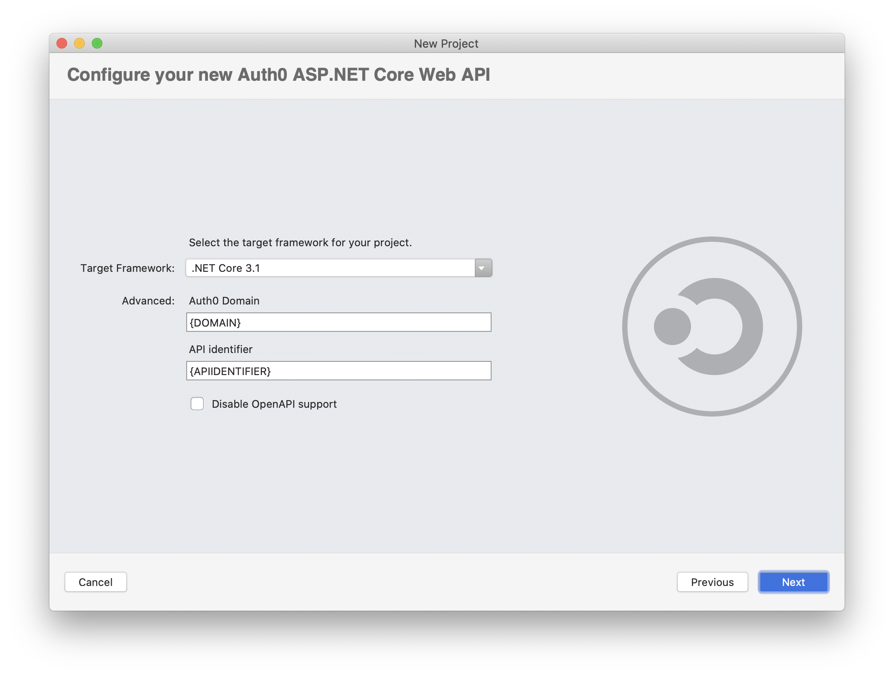

# Auth0 Templates for .NET
The Auth0 Templates for .NET package allows you to quickly bootstrap a .NET application secured with Auth0. You can use the Auth0 Templates with the .NET CLI and Visual Studio.

## Getting started

### Requirements

* An Auth0 account. You can [sign up for a free one](https://auth0.com/signup) right now.
* .NET Core 3.1 SDK or higher.

### Installation

You can install the Auth0 Templates from the NuGet repository or from the source code.

> :warning: The current version of Auth0.Templates are not published on NuGet yet.

To work locally with the Auth0 Templates, i.e., using the templates coming from the source code, execute the following steps:

1. Clone this repository

2. Create a local NuGet package by running the following command in the root folder of the project:

   ```bash
   dotnet pack
   ```

   Your NuGet package will be generated in the `./bin/Debug/` folder.

3. Install the templates by running the following command:

   ```bash
   dotnet new -i ./bin/Debug/Auth0.Templates.2.0.0-alpha.nupkg
   ```

> :warning: **NOTE**: Currently, to make project templates available also for Visual Studio, you need to apply some additional configuration steps. Please, [take a look at this blog post](https://devblogs.microsoft.com/dotnet/net-cli-templates-in-visual-studio/).

## Usage

Currently, the following .NET templates are implemented:

- [Auth0 MVC Application](#Auth0-MVC-Application)
- [Auth0 Web API Application](#Auth0-Web-API-Application)


### Auth0 MVC Application

For more information about creating and securing an ASP.NET MVC application with Auth0, check out the [Auth0 ASP.NET MVC Quickstart](https://auth0.com/docs/quickstart/webapp/aspnet-core/01-login).

#### Using the .NET CLI

To create a new MVC application with the .NET CLI, you can run the following command:

```
dotnet new auth0mvc [options]
```

This will create a new MVC application in the current folder. The following template-specific options are available:

Option | Description |
---------|----------|----------
`-d` or `--domain` | The Auth0 domain associated with your tenant. The default value is `{DOMAIN}`. |
`-c` or `--clientId` | The client id associated with your application. The default value is `{CLIENT_ID}`. |
`-cl` or `--clientSecret` | The secret associated with your application. The default value is `{CLIENT_SECRET}`. |
`-f` or `--framework` | Defines the target framework to use for the .NET project. The possible values are `netcoreapp3.1` and `net5.0`. The default value is `netcoreapp3.1`. |

#### Using Visual Studio

To create a new MVC application with Visual Studio, select the *Auth0 ASP.NET Core App* from the *Web and Console* application group:



Then, provide the required options:



### Auth0 Web API Application

For more information about creating and securing an ASP.NET Web API application with Auth0, check out the [Auth0 ASP.NET Web API Quickstart](https://auth0.com/docs/quickstart/backend/aspnet-core-webapi).

#### Using the .NET CLI

To create a new Web API application, you can run the following command:

```
dotnet new auth0webapi [options]
```

This will create a new Web API application in the current folder. The following template-specific options are available:

Option | Description |
---------|----------|---------
`-d` or `--domain` | The Auth0 domain associated with your tenant. The default value is `{DOMAIN}`. |
`-ap` or `--apiId` | The API identifier as defined in your Auth0 dashboard. The default value is `{ASPI_IDENTIFIER}` |
`-f` or `--framework` | Defines the target framework to use for the .NET project. The possible values are `netcoreapp3.1` and `net5.0`. The default value is `netcoreapp3.1`. |
`-`no or `--noOpenAPI` | It prevents OpenAPI documentation generation (`true`). The default value is `false`. |

#### Using Visual Studio

To create a new Web API application with Visual Studio, select the *Auth0 ASP.NET Core Web API* from the *Web and Console* application group:



Then, provide the required options:



## License

This project is licensed under the MIT license. See the [LICENSE](LICENSE) file for more info.